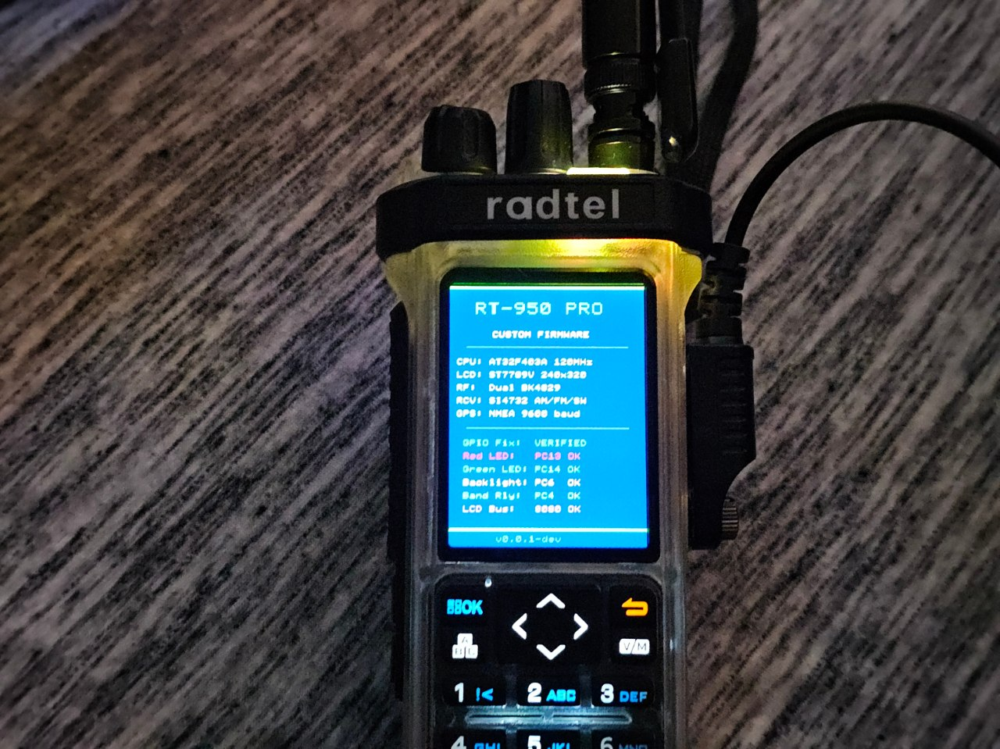

# RT-950 Pro Custom Firmware
## Why this fork?
This is an experimental fork of the Open-source bare-metal firmware for the **Radtel RT-950 Pro** handheld radio.  The original project did all the hard work, I'm just making it work on A radio without any idea whether this helps or hinders the next radio. 
- very new to this hardware and project (consider yourself warned), so this is a sandbox while I try to figure out what is wrong with my hardware that it won't run the main fork.
- hardware tests output is optionally mirrored on the serial port (DEBUG=1)
- working: flash, init, GPS data read, keypad, serial port, screen, side keys, LEDs
- not correct: tuners, audio

**Target**: Artery AT32F403A (ARM Cortex-M4F @ 120 MHz, 1 MB flash, 96 KB SRAM)

## Status

> [!WARNING]
> This is heavily work-in-progress and still is ridden with bugs. Early hardware bring-up. Boot screen, LEDs, LCD, and GPIO confirmed working on real hardware.

### Hardware Confirmed

- **LCD**: ST7789V 240x320 via 8080 parallel bus (PD0-PD15), custom text rendering
- **LEDs**: Red (PC13), Green (PC14)
- **Backlight**: Primary (PC6), Secondary (PB3)
- **Power latch**: PB9
- **Band relay**: PC4
- **Boot**: Custom firmware loads and runs via OEM bootloader

### What's Implemented (Roughly Code-Complete, Untested)

- **Hardware drivers**: GPIO, SPI2 (flash), bit-bang SPI (BK4829), bit-bang I2C (SI4732), USART1/3/UART4, ADC2, DAC1+TIM6+DMA, ST7789V LCD (8080 parallel), DMA1/DMA2
- **RF control**: Dual BK4829 transceiver driver, frequency programming, TX power levels, calibration tables from flash
- **Application layer**: Dual VFO (A/B/C), PTT with active-low relay control, keypad scanner with debounce, rotary encoder, S-meter, menu system, frequency entry
- **Digital modes**: APRS (hardware FSK via BK4829, MIC-E packets), DTMF encode/decode, CTCSS/DCS tone generation
- **Receivers**: SI4732 AM/FM/SSB broadcast radio, FM broadcast with presets, weather channels
- **Data**: SPI flash layout (990 channels, VFO configs, settings), wear-leveled NV storage, CPS programming protocol (UART4)
- **Comms**: GPS NMEA parser, Bluetooth BLE data bridge, VOX, NOAA weather radio (SI4732 WB)
- **UI**: Display rendering, splash screen, zone browser, text input, scanner, spectrum analyzer, hierarchical 12-category menu
- **Radio**: Cross-band repeat (A->B, B->A, duplex), band-specific relay routing, interrupt-driven UART
- **Safety**: PTT relay polarity verified (active-low), PA gate timing, TX band limits
- **Tools**: BTF firmware encrypt/decrypt, CPS flash read/write, firmware upload with auto-restart

### What's Not Done

- Most peripherals untested on hardware (SPI flash, BK4829, SI4732, GPS, keypad, encoder)
- Bluetooth audio streaming (AT commands only)
- Voice prompt audio samples (tone patterns only)

### Example Hardware Test



## Building

### Prerequisites

- `arm-none-eabi-gcc` (12.x or later)
- `python3` with `pyserial`
- `make`

### Build

```bash
make                  # Build release firmware
make DEBUG=1          # Build with debug UART output
make btf              # Generate encrypted .BTF for upload
make btf DEBUG=1      # Generate debug .BTF
make size             # Print flash/RAM usage
make clean            # Remove build artifacts
```

### Upload to Radio

```bash
# Normal upload (auto-enters bootloader via PROGRAMBT9000U handshake)
python3 tools/firmware_upload.py upload /dev/ttyUSB0 build/rt950-custom.BTF -v

# Radio already in bootloader (side buttons held at power-on)
python3 tools/firmware_upload.py upload /dev/ttyUSB0 build/rt950-custom.BTF --ptt -v

# Reset back to default firmware
python3 tools/firmware_upload.py upload /dev/ttyUSB0 binary/RT_950Pro_V0.27_260203/RT_950Pro_V0.27_260203.BTF --ptt -v
```

### Hardware Tests

```bash
make test TEST=1   # Backlight blinky
make test TEST=2   # UART echo (GPS + BT)
make test TEST=3   # LCD color bars
make test TEST=4   # BK4829 chip ID read
make test TEST=5   # SI4732 revision read
make test TEST=6   # SPI flash JEDEC ID
make test TEST=7   # ADC battery + audio
make test TEST=8   # DAC 1 kHz tone
make test TEST=9   # Keypad + encoder scan
make test TEST=10  # GPS NMEA display
make test TEST=11  # Full system diagnostic
```

### Output Files

| File | Description |
|------|-------------|
| `build/rt950-custom.elf` | Linked ELF with debug symbols |
| `build/rt950-custom.bin` | Raw binary for flashing |
| `build/rt950-custom.hex` | Intel HEX for flashing |
| `build/rt950-custom.BTF` | Encrypted firmware for upload |

## Memory Layout

```
Flash:
  0x08000000  OEM Bootloader (12 KB, permanent)
  0x08003000  Custom firmware starts here <- linker ORIGIN
  0x08100000  End of flash (1 MB)

SRAM:
  0x20000000  .data + .bss + heap
  0x20017BB0  Stack top (matches OEM)
  0x20018000  End of SRAM (96 KB)
```

The bootloader only checks that `[0x08003000]` is a valid SRAM address.
**No CRC, no signature** - custom firmware is flashable via the standard OEM update tool.

## Tools

| Tool | Description |
|------|-------------|
| `tools/firmware_upload.py` | Upload .BTF firmware to radio via serial |
| `tools/encrypt_btf.py` | Encrypt/decrypt BTF firmware files |
| `tools/cps_flash.py` | Read/write radio configuration via CPS protocol |

See [tools/README.md](tools/README.md) for detailed usage and protocol documentation.

### Known BTF Encryption Keys

| Version | Key (hex) |
|---------|-----------|
| V0.15 | `71CAEFACD047EF83EFD2141A3512A638` |
| V0.18 | `DC24DEF7CF4F3FED91BCC88BB0613A51` |
| V0.21 | `3C0F640BB03230BB97AF8029C4AD794D` |
| V0.27 | `7E807B1761A4EBC6FC3A8DD33752F305` |

Keys are stored at offset 0x400 in the `.BTF` file. Use `--auto` to extract automatically.

## Key Notes

**GPIO registers**: AT32F403A uses SCR at +0x10 (set pin HIGH) and CLR at +0x14 (clear pin LOW). The OEM GPIO helpers are at 0x080155B2 (set) and 0x080155AE (clear).

**PTT relays are active-low**: All relay pins SET HIGH = deactivated (RX/idle). Pins are CLEARED to activate TX path. Wrong polarity = PA damage.

**SPI1 is unused**: Despite being a standard SPI peripheral, the OEM firmware never configures SPI1. PA7 (SPI1_MOSI) is actually the keypad latch line.

**Dual BK4829 RF chips**: Chip 0 (CS=PE8) handles main VFO, chip 1 (CS=PE15) handles sub-receiver and APRS. They share clock (PE10) and data (PE11) lines.

**Unused peripherals**: SPI1, ADC1, USART2, I2C1/I2C2 hardware, DMA2 CH1 have zero references in the OEM binary.

## Contributing

Please feel free to contribute, we will be working through the hardware testing and implementation but if you have helpful information or would like to make pull requests, please do! Feel free to make PRs or open a discussion.

## License

This project is for educational and amateur radio experimentation purposes.
See [LICENSE](LICENSE) for details.
